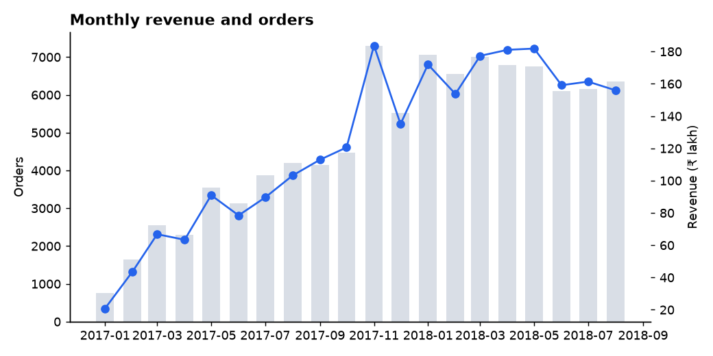
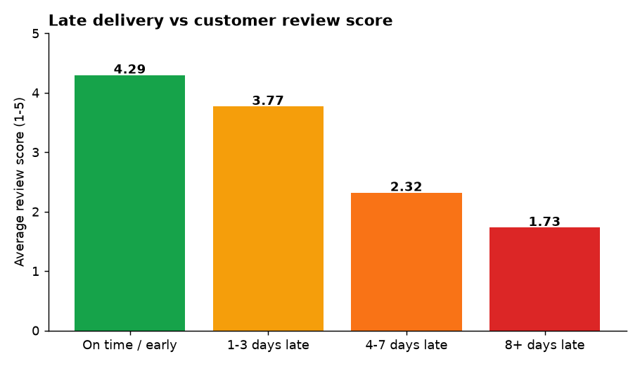
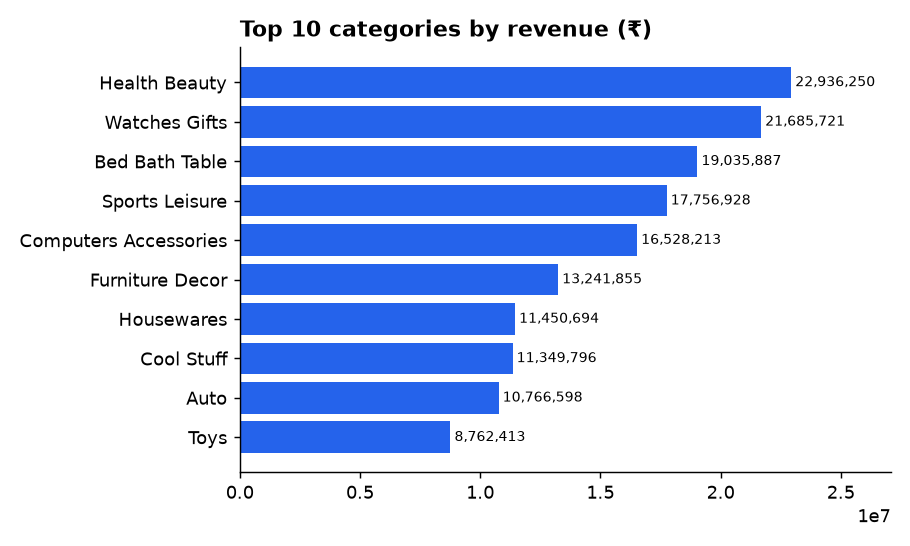
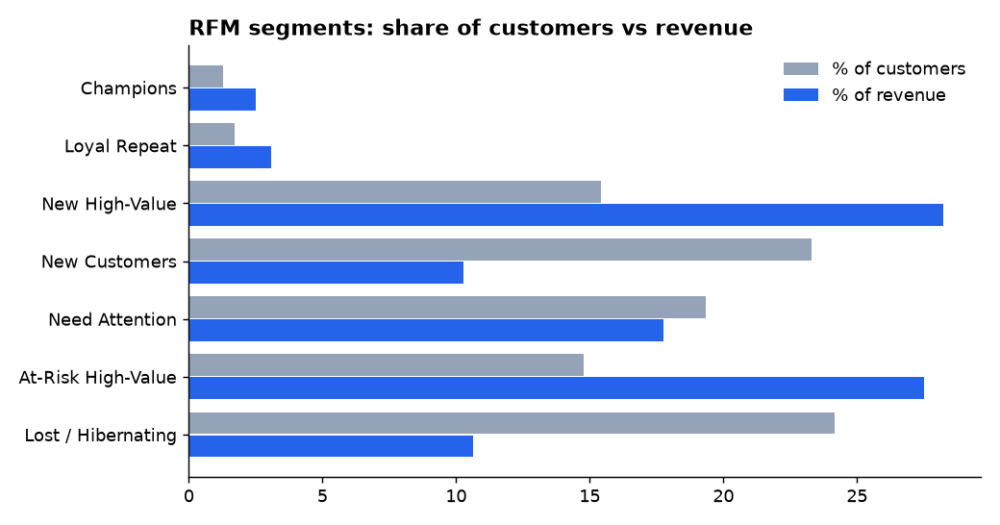

# Olist E-commerce: Sales, Customer & Delivery Analytics

End-to-end analytics project on the Olist Brazilian e-commerce dataset using **SQL, Python and Power BI**.

## Business problem
The business wants to grow revenue and retention. This project answers: **how is revenue trending and where does it come from, who are the best customers and how many come back, and does late delivery hurt customer satisfaction?**

## Dataset
[Olist Brazilian E-commerce (Kaggle)](https://www.kaggle.com/datasets/olistbr/brazilian-ecommerce): about 100K orders (2016-2018) across 9 related tables (orders, items, payments, reviews, customers, sellers, products, geolocation, category translation). Currency: the source data is in Brazilian Real (BRL); values in this project are converted to INR at a fixed 1 BRL = ₹18.6.

## Tools
SQL (PostgreSQL), Python (pandas, matplotlib, plotly), Power BI (data modelling, DAX)

## Approach
1. **Data cleaning (Python):** joined 8 tables, standardised categories, handled missing delivery dates, duplicate reviews and missing categories.
- Total orders in raw data: 99,441
- Orders with status 'delivered': 96,478
- Orders with duplicate reviews (kept the average score): 551
- Products with missing category (labelled 'Unknown'): 610
- Delivered orders dropped (no delivery date): 8
- Final orders used in analysis: 96,470
2. **SQL analysis:** revenue trend, MoM growth (window functions), category and seller ranking, delivery performance, repeat vs one-time customers, revenue concentration (see `sql/queries.sql`).
3. **RFM segmentation (Python):** customers scored on Recency, Frequency and Monetary value and grouped into 7 segments.
4. **Dashboard (Power BI):** 3 pages (Executive Summary, Customers, Delivery & Operations) on a star-style data model.

## KPIs
| Revenue | Orders | Customers | Avg order value | Avg review | Avg delivery | Late orders |
|---|---|---|---|---|---|---|
| ₹24.59 Cr | 96,470 | 93,350 | ₹2,549 | 4.16 / 5 | 12.6 days | 8.1% |

## Key insights
1. The business generated **₹24.59 Cr** from **96,470** delivered orders and **93,350** unique customers (average order value **₹2,549**). Revenue for Jan-Aug 2018 was +141% versus the same months of 2017.
2. Revenue peaked in **Nov 2017** at **₹1.84 Cr**; stock and logistics capacity should be planned ahead of peak months.
3. **Late delivery hurts satisfaction:** on-time orders average **4.29** stars versus **2.57** for late orders (a gap of 1.73). Orders 8+ days late average **1.73**. Overall, **8.1%** of orders arrive after the promised date.
4. Only **3.0%** of customers ever bought a second time, so almost all revenue comes from one-time buyers. The top 20% of customers contribute **54%** of revenue.
5. The top 5 categories account for **40%** of revenue (led by **Health Beauty**). **SP** alone contributes **38%**, which shows heavy geographic concentration.
6. Delivery is slowest in **AL, PA, MA** (up to **25 days** on average vs **12.6** overall).
7. **28,180** one-time customers sit in the 'New High-Value' or 'At-Risk High-Value' RFM segments. These are the best targets for a win-back or second-purchase campaign. Credit card is used on **75%** of orders.

## Recommendations
1. **Fix delivery before marketing:** audit carriers and promised-date logic in AL, PA, MA; set realistic delivery estimates so fewer orders are late. Track late-delivery % as a weekly KPI.
2. **Build a repeat-purchase programme:** with a 3.0% repeat rate, a post-delivery email/voucher flow for 'New High-Value' and 'New Customers' (30-60 days after purchase) is a low-cost way to grow revenue.
3. **Win back high-value lapsed customers:** target the 'At-Risk High-Value' segment with a personalised offer in its top categories.
4. **Plan for peaks:** build stock and carrier capacity before November, the strongest month.
5. **Reduce geographic dependence:** recruit sellers and improve fulfilment for states outside SP so delivery times there fall.

## Dashboard preview

### Power BI dashboard

**Page 1: Executive Summary**


**Page 2: Customer Segmentation**


**Page 3: Delivery and Satisfaction**


### Python analysis charts

| Monthly revenue | Delay vs review |
|---|---|
|  |  |
|  |  |

## Repository structure

```
sql/          SQL queries
notebooks/    Python analysis (olist_analysis.ipynb)
powerbi_data/ created when you run olist_pipeline.py (not uploaded, files are large)
dashboard/    Power BI file (.pbix) and interactive HTML preview
images/       charts and dashboard screenshots
```

## How to run
```
pip install -r requirements.txt
python olist_pipeline.py
```

## Limitations
Findings are associations from observational data (for example, late delivery is linked with lower ratings but other factors may also play a part). The source data is in Brazilian Real; all values are converted to INR at a fixed 1 BRL = ₹18.6 for illustration (SQL outputs on the raw data are in BRL). Revenue uses item price, excluding freight. Early 2017 and late 2018 months are partial and excluded from trend charts.

## Author
Arnav Shirke | [LinkedIn](https://www.linkedin.com/) | Data / Business Analyst
